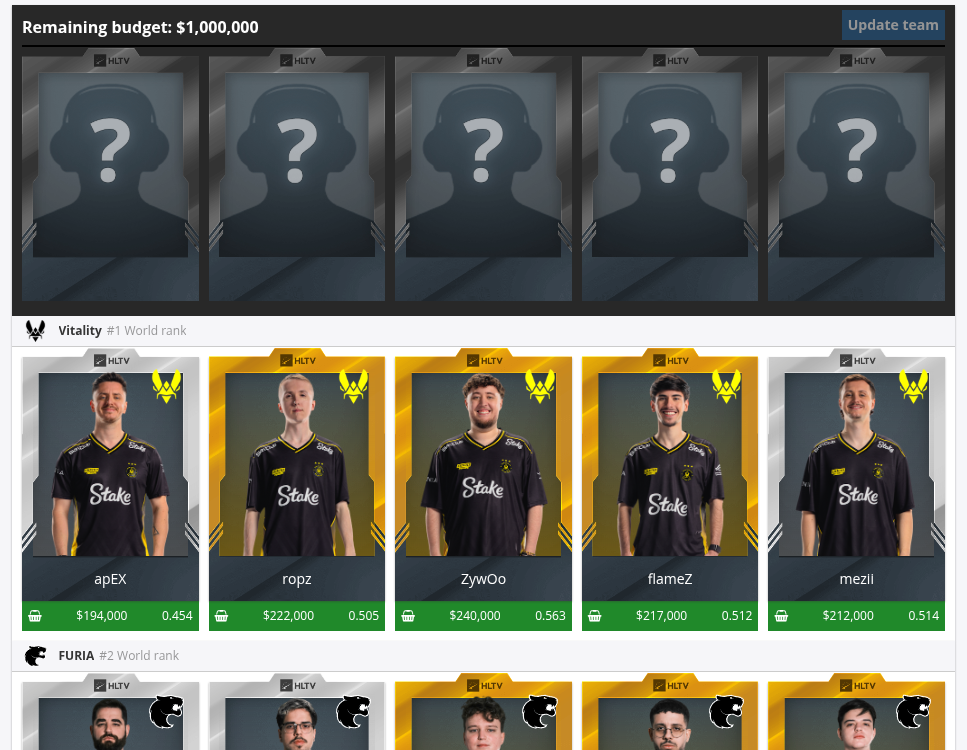

# HLTV Fantasy Values
A browser extension to give a single value for players in HLTV fantasy leagues.

The extension appends a decimal number that represents the "value" or bang-for-your-buck the player offers. \
My [formula](content-script.js#L32) is quite simple. Just `rating / price * 100000`. \
It can then help give an overview of which players are over/under-priced, and if you're as smart as me you might just get top 80%.

## Installation
Google's piece of shit age verification system doesn't let my account sign up as a dev, so you have to install manually on Chrome.

### Chrome
1. Go to [Releases](https://github.com/zzzealed/hltv-fantasy-values/releases/latest) and download the latest `.crx`-file
2. Open `chrome://extensions`
3. Drag-and-drop the `.crx`-file onto the page

### Firefox

Or manually:
1. Go to [Releases](https://github.com/zzzealed/hltv-fantasy-values/releases/latest) and download the latest `.xpi`-file
2. Open `about:addons` and press the cog -> Install Add-on From File...
3. Select the downloaded `.xpi`-file

## TODOs
- [ ] Color code values
- [ ] Re-center price-text
- [x] Check if extension actually works when originally making lineup and not just after editing
- [x] Fix issue where you need to refresh edit-page
